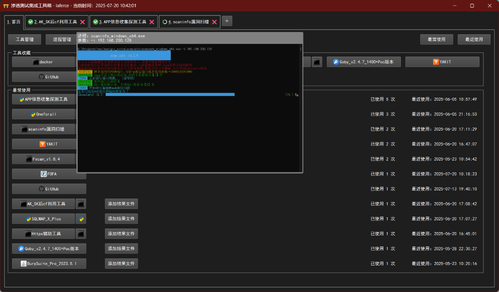
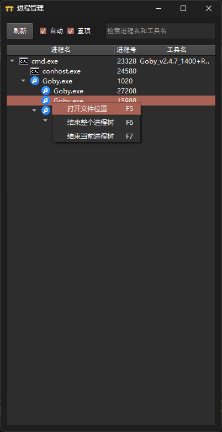
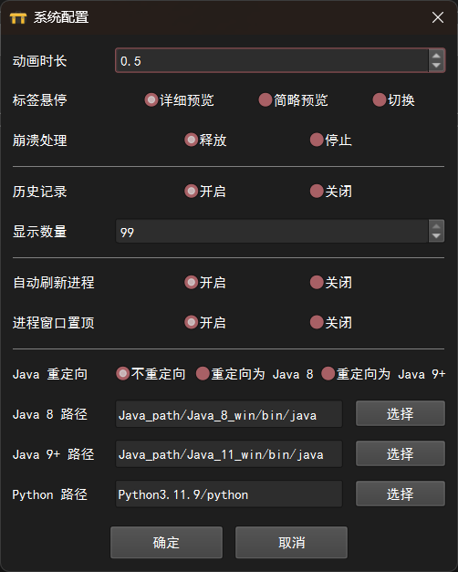

# cybertoolsuite
管理用户自建的各类软件工具（出发点是管理渗透测试类工具，但可以推广到各类软件工具和在线工具），并对其使用体验进行优化。本工具集主要对命令行程序进行了大量优化，对工具检索、环境配置、工具自定义、扫描结果管理、进程管理方面的用户体验也进行了大量探索。

致谢：狐狸说安全_One-Fox安全团队和各大工具的作者们。

本工具箱的开发目标是以一种（看起来）比较先进的方式，管理用户自建的各类软件工具（出发点是管理渗透测试类工具，但可以推广到各类软件工具和在线工具），并对其使用体验进行优化。本工具箱主要对命令行程序进行了大量优化，对工具检索、环境配置、工具自定义、扫描结果管理、进程管理方面的用户体验也进行了大量探索。

## 一、首页

启动后直接进入首页。

> 1.1下方是使用工具的历史记录，可以在右上角切换"最常使用"和"最近使用"，可以在左上角"系统配置"中关闭；可以通过"添加结果文件"按钮或在内嵌工具选项卡（见第三节）中"发送到首页"功能将需要关注的结果文件保存在这里；
>
> 1.2上方是工具收藏列表，可以选择喜欢的工具加入收藏，可以拖拽排序；
>
> 鼠标停留查看工具描述，左键启动工具，右键启动菜单。

## 二、工具列表

点击工具箱上方"+"按钮打开工具列表，支持以两种模式检索所需工具，在左上角切换检索模式。

工具分为三类：

> 2.1命令行工具：在工具列表中显示为两个并排的按钮：
>
> 2.1.1点击大按钮新建一个选项卡，并启动内嵌于工具箱的命令行窗口，包含多种功能加强，详见下一章节；
>
> 2.1.2点击小按钮启动独立的命令行窗口，自动将命令发送到窗口但不执行。
>
> 2.2界面工具：在工具列表中显示为单个按钮，启动工具自身窗口；
>
> 2.3在线工具：在工具列表中显示为单个按钮，通过默认浏览器打开，可以为每个工具单独配置浏览器。
>
> 鼠标停留查看工具描述，左键启动工具，右键启动菜单；检索工具时同时从工具名称和工具描述中查找匹配的文字，切换到网页模式后，可以方便地查看工具描述。
>
> 各类本地工具的描述中都添加了GitHub仓库或官方主页地址；欢迎用户对各工具的功能进行更精确的描述。

## 三、命令行工具功能增强

点击命令行工具的大按钮，将新建一个选项卡，并启动内嵌于工具箱的命令行窗口。

> 3.1查看文档

> 点击"查看文档"按钮查看命令行工具文档，Ctrl+F搜索关键字，点击蓝色或紫色标签生成命令，生成时会自动将java、python转换为已配置的环境变量路径，按回车键或点击"执行命令"按钮将命令发送到命令行窗口。
>
> 3.2工具运行
>
> 当命令行窗口中有进程（无论是不是本工具的进程）正在运行时，标签图标会变成指示运行中状态的动态图标；右上角的按钮可以冻结和恢复正在运行中的进程，以应对特殊需求。
>
> 3.3结果监控

> 右边是结果监控区域，配置结果文件目录和格式后会自动监控（未配置时默认监控工具所在目录的\*.txt文件），双击打开查看；
>
> 支持像资源管理器一样，通过快捷键或右键菜单执行各类操作，打开右键菜单时，会检测剪切板中是否存在文件列表，并自动修改"粘贴"项的文本以提示用户后续操作是复制还是剪切；
>
> "发送到首页"功能支持将选择的文件发送到工具箱首页，以便快捷查看；
>
> 点击"配置输出"按钮并选择结果文件（支持选择多个）后，会将文件所在目录设置为监控目录，选择的文件格式设置为监控格式（不是只监控选择的文件，而是监控所有匹配的格式），最多支持前5种格式。
>
> 3.4进度预览

> 在系统配置-标签悬停中选择预览选项，鼠标悬停时可以预览进程信息和执行进度（类似Windows的AERO预览效果）。
>
> 3.5进程重启

> 如命令行进程意外结束，标签图标将切换为禁止图标，同时在命令行区域显示重启进程的按钮。

## 四、工具管理

可以通过工具按钮的右键菜单或首页"工具管理"按钮进行工具管理。

> 4.1内置工具编辑

> 所有工具都支持编辑和删除；命令行工具、界面工具、在线工具分别具有不同的配置项。以下对部分不是特别显而易见的配置进行说明：
>
> 4.1.1添加和编辑工具时，程序文件只能选择工具箱所在目录或子目录的文件，结果文件只能选择程序文件所在目录或子目录的文件，因此程序路径和输出目录都是相对路径形式；编辑时不能改变工具类型；
>
> 4.1.2程序路径、程序文件、输出目录等文本框不可自行编辑，需要通过相关按钮选择文件生成；帮助文档、浏览器等文本框也需要通过相关按钮选择文件，但可以按退格键或删除键清空；
>
> 4.1.3运行方式分为可执行程序、java、java8、java9+、python五种，其中java8、java9+、python默认使用工具箱内置运行环境（内置的java9+版本为jdk21），可在系统配置中修改，java默认使用用户自建的java环境；
>
> 4.1.4命令行工具和界面工具的图标可以选择根据工具类型、运行方式和程序文件自动匹配，也可以点击图标按钮手动指定；未选择程序文件时，命令行工具默认使用cmd图标，界面工具没有默认图标；在线工具的图标指定图标文件后，保存时会复制到图标文件目录，如不指定将默认使用edge图标，未手动指定使用浏览器时，将使用系统默认浏览器；
>
> 4.1.5命令行工具选择结果文件（支持选择多个）后，会将文件所在目录设置为监控目录，与选择的文件匹配的格式设置为监控格式，效果与命令行工具运行界面中配置结果监控效果相同，输出格式栏也可以手动填写，填写后会展示多个图标（监控格式最多支持前5种格式，图标也只显示前5个）；指定帮助文档后，保存时会复制到帮助文档目录；
>
> 4.1.6当工具箱检测到指定的命令行工具或界面工具正在运行时，无法编辑，该检测结果的准确性依赖具体的工具配置，有少数工具无法检测；在线工具编辑不受此限制。
>
> 4.2工具管理器

> 4.2.1支持自定义工具的添加、编辑、删除，不支持对内置工具的管理；
>
> 4.2.2支持对工具分类进行添加、编辑、删除、排序操作。

## 五、进程管理

从工具箱通过工具按钮运行本地工具关联的，且持续运行中的进程，都将在此管理。支持以树状图查看相关进程详情，并可以结束进程树。进程管理窗口是独立窗口，不阻塞工具箱操作，可以置顶显示。对处于部分状态的进程用不同颜色背景高亮显示：

绿色高亮：刚创建的进程，持续两次刷新；

红色高亮：刚关闭的进程，不会马上移除，持续两次刷新后再移除；

灰色高亮：冻结中的进程；

紫色高亮：待捕捉的进程；

深红色高亮：该进程的用户与运行工具箱的用户不一致。

> 5.1查看文件位置（快捷键F5）
>
> 根据进程名字不同，可以打开对应文件所在目录并选中对应文件：
>
> 5.1.1根cmd.exe进程和根conhost.exe进程：选中该工具配置的程序文件；
>
> 5.1.2 java.exe进程：选中以-jar参数运行的jar包，难以判断时选中java；
>
> 5.1.3 python.exe进程：选中进程运行的py脚本，难以判断时选中python；
>
> 5.1.4其他exe进程（包括非根cmd和conhost进程）：选中该exe文件。
>
> 5.2结束进程树
>
> 点击右键菜单的两个"结束进程树"选项，可以结束对应进程树，根据选定进程类型不同，会自动隐藏不适用的选项按钮：
>
> 5.2.1
> 结束整个进程树（快捷键F6）：结束选定进程所在的整个进程树；对内嵌工具，将保留根cmd进程和根conhost进程；
>
> 5.2.2
> 结束当前进程树（快捷键F7）：结束以选定进程为根的进程树，无特殊理由，不建议采用该方式。
>
> 5.3残留进程管理
>
> 5.3.1关闭工具箱不影响非内嵌工具进程的运行，后续启动工具箱后仍然在运行的，会自动纳入管理；
>
> 5.3.2工具箱正常关闭选项卡时，会自动关闭内嵌工具进程。如果工具箱发生非正常关闭，根据情况不同，有以下两种处理方式：
>
> 5.3.2.1工具箱内置报错弹窗机制，若报错弹窗太多会触发弹窗关闭，若短时间报错太多会触发无弹窗关闭。如果在系统配置-崩溃处理中设定了释放选项，会将命令行窗口释放回桌面，可以继续使用，下次启动后可以在进程管理窗口查看，点击捕捉窗口可捕捉并重新嵌入到工具箱；如果设定了停止选项，会直接关闭相关进程；

> 5.3.2.2如果直接杀死工具箱进程时有内嵌工具正在运行，会导致conhost和cmd进程残留，但因窗口句柄已被破坏，无法再次利用，且在较高版本Windows
> 11上尝试结束进程会导致蓝屏重启！

## 六、系统配置

当前版本包含配置项如下图，以下仅对部分配置项进行说明：

6.1动画时长：改为0可关闭动画效果；

6.2标签悬停：鼠标在标签上悬停时的对应动作：

6.2.1详细预览可通过大预览窗口查看对应内嵌工具进程信息和执行进度；

6.2.2简略预览可通过小预览窗口查看对应内嵌工具执行进度；

6.2.3切换可在悬停时直接切换到对应选项卡，体验上更方便。

6.3崩溃处理：工具箱触发报错关闭时的对应动作：

6.3.1释放可将内嵌工具的命令行窗口释放回桌面，可继续使用或重新捕捉；

6.3.2停止直接结束相关进程。

6.4
Java重定向：将默认的Java环境重定向到Java8或Java9+环境，如果用户不打算安装Java环境，可以使用此配置；

6.5环境变量配置：环境变量如果配置为工具箱内部目录，将保存为相对路径以方便移动；将某项路径清空，可将对应环境变量配置为用户自己安装的环境；环境变量的具体配置参照下面的附录一。

## 附录一：环境变量

java8环境和java9+环境由<a style="color:red">狐狸说安全_One-Fox安全团队</a>内置于<a style="color:red">ONE-FOX集成工具箱_V8.2公开版</a>，其中java8用于针对java8开发的旧程序，java9+（内置的环境实际版本为java21）用于针对java9及以上版本开发的新程序。

java环境使用用户自建的java环境，如用户没有自建的java环境，或使用自建的java环境时依赖错误，可在工具编辑中调整单个工具的运行方式，或在系统配置中选择将java环境重定向到java8或java9+环境。

python环境由作者安装完所需第三方库后内置到工具箱中，推荐直接使用，用户也可使用自建的python环境。

将任意环境所在路径清空后，可使用用户自建的环境。

## 附录二：现有工具已知问题

（一）burpsuite：

1.由于burpsuite的启动脚本BurpSuiteLoader.bat最后有一条pause语句，会在关闭工具窗口后导致进程残留，可在进程管理中结束残留进程，建议直接删除pause；

2.默认情况下burpsuite处于未激活状态，需自行配置激活，或使用burploader附加工具激活。

（二）雪影信息收集工具：会创建独立进程，无法被进程管理模块管理。

（三）webpack：使用python3.11及以上版本时，需要将下图选中部分的内容删除

## 附录三：工具箱已知问题处理

直接结束工具箱进程时，如果存在内嵌工具，会导致无窗口的conhost和cmd进程残留，在高版本Windows
11上切勿尝试结束这两个进程，否则将导致蓝屏重启。

工具箱出故障时，除非无预兆直接崩溃，否则应当确保先结束内嵌工具进程。

如果无法避免出现残留进程，只有重启系统才能消除。这两个残留进程本身不影响系统运行，但如果cmd进程内部还有其他子进程运行，只能通过各类进程管理工具结束，结束时切勿误杀根conhost进程和根cmd进程，为防止判断错误，推荐使用具有树状进程视图的进程管理工具（如微软官方的Process
Explorer等）。
